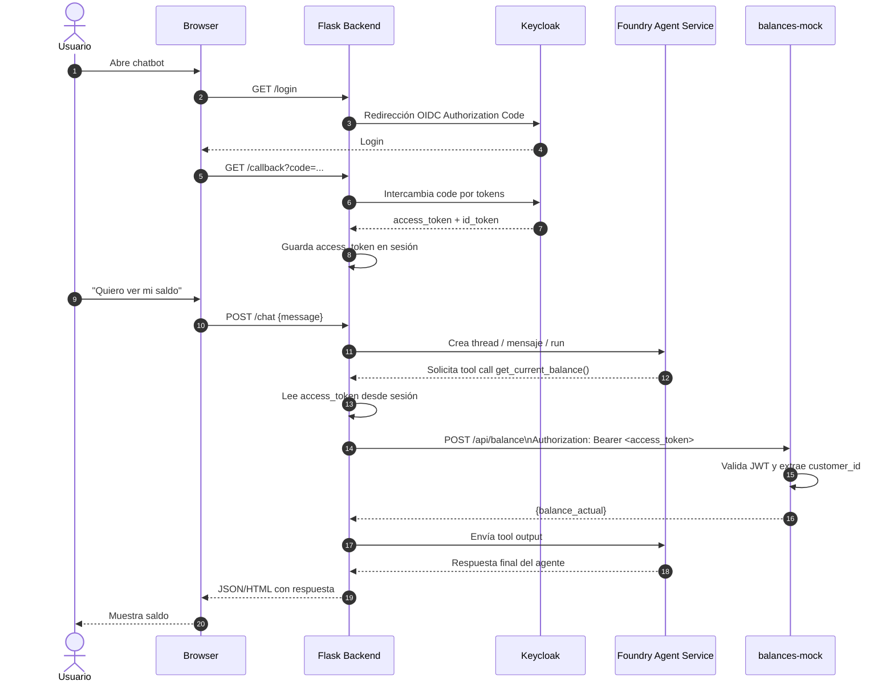

# Auth With AI Foundry Agents

## Resumen de la PoC

1. **Objetivo**

   * Validar un sistema **multiagentes** en Azure AI Foundry Agent Service con:

     * Autenticación real contra **Keycloak**.
     * Consumo de un **microservicio mock de balances**.
     * Front de **chat web en Flask**.
     * Todo el código en **Python**.

2. **Alcance funcional**

   * Un único caso de uso: **consultar saldo total** de una única cuenta por usuario.
   * Usuario se autentica primero en Keycloak, luego usa el chat.
   * Respuestas en lenguaje natural, tono conversacional.
   * Hasta 3 usuarios simultáneos.

3. **Flujo general**

   ```
   Usuario → Flask (login + chat)
      │  (OIDC con Keycloak, obtiene JWT)
      ▼
   Flask → Agent Service (envía mensaje + JWT en metadata)
      ├─ Agente Policía: normaliza texto y valida intención
      └─ Agente Balances: llama tool HTTP
             │
             ▼
       Microservicio mock (Python, HTTPS)
             │ valida token usuario + token agente
             ▼
       Devuelve balance_actual según customer_id
   ```

4. **Agentes**

   * **Agente Policía**

     * Normaliza texto: minúsculas, sin caracteres no alfanuméricos, sin emojis, sin saltos de línea ni espacios extra.
     * Solo deja pasar intents de “consultar saldo”.
   * **Agente Balances**

     * Llama al microservicio usando un **tool HTTP** con:

       * Token del agente (client_credentials).
       * JWT del usuario recibido desde Flask (no en el prompt, solo en headers/metadata).
     * Construye respuesta conversacional con el `balance_actual`.

5. **Autenticación / autorización**

   * **Keycloak** como IdP único.
   * Realm dedicado: `poc-balance`.
   * Usuarios con atributo `customer_id`.
   * Tokens:

     * JWT de usuario (OIDC) para identificar `customer_id`.
     * Token de cliente para el agente (OAuth2 `client_credentials`).
   * El microservicio:

     * Extrae `customer_id` desde el JWT del usuario.
     * Ignora cualquier `customer_id` que venga del cuerpo o del prompt.
     * Valida también el token del agente.

6. **Microservicio de balances (mock, Python)**

   * Desplegado en Azure (ej: App Service / Container Apps).
   * Implementado en Python (Flask o similar).
   * Endpoint HTTPS `POST /api/balance`.
   * Headers:

     * `Authorization: Bearer <user_jwt>`
     * `X-Agent-Token: Bearer <agent_token>`
   * Respuesta:

     ```json
     { "balance_actual": 152000.50 }
     ```
   * Balance simulado según `customer_id`.

7. **Frontend de chat (Flask, Python)**

   * Implementado en **Flask**.
   * Funciones:

     * Integración con Keycloak (OIDC) para login y logout.
     * Guardar el JWT del usuario en sesión.
     * Endpoint de chat que:

       * Toma el mensaje del usuario.
       * Envía el mensaje al Agent Service.
       * Adjunta el JWT del usuario como metadata/header para el tool.
       * Muestra la respuesta del agente en la UI.

---

## Qué se debe desarrollar / configurar (checklist)

### A. Keycloak (configuración)

1. Crear **realm** `poc-balance`.
2. Crear usuarios de prueba con atributo `customer_id`.
3. Crear **clients**:

   * `poc-chat-frontend`

     * Tipo: public / OIDC.
     * Flujo: `authorization_code` (idealmente con PKCE).
     * Redirect URIs apuntando al Flask.
   * `poc-agent-service`

     * Tipo: confidential.
     * Flujo: `client_credentials`.
     * Scope mínimo: `read_balance`.
4. Crear mapper para exponer `customer_id` como claim en el JWT de usuario.

### B. Microservicio mock de balances (Python)

1. API en Python (Flask) con:

   * Ruta `POST /api/balance`.
   * Validación de:

     * JWT de usuario (firma + expiración + realm + claim `customer_id`).
     * Token del agente vía introspection o verificación simple según configuración de PoC.
2. Simulación de datos:

   * Tabla/estructura en memoria: `customer_id` → `balance_actual`.
3. Despliegue en Azure con HTTPS activado.

### C. Agentes y tools en Azure AI Foundry

1. **Agente Policía**

   * Definir prompt / lógica en Python para:
     * Normalización del texto.
     * Detección de intención “consultar saldo”.
     * Mensaje de rechazo genérico si la intención no es válida.

2. **Agente Balances**

   * Tool HTTP configurado para llamar al microservicio:

     * Conexión OAuth2 (client_credentials) usando `poc-agent-service`.
     * Capacidad de recibir el JWT del usuario desde metadata/headers.
   * Lógica en Python para:

     * Consumir la respuesta `{balance_actual: X}`.
     * Devolver respuesta amigable al usuario.
3. Orquestación:

   * Flujo multiagente donde el Policía es el primer filtro y solo si aprueba pasa al agente de Balances.

### D. Frontend Flask (Python)

1. Integración OIDC con Keycloak:

   * Rutas: `/login`, `/callback`, `/logout`.
   * Manejo de sesión con el JWT del usuario.
2. Página de chat:

   * Formulario simple para enviar mensajes.
   * Llamada al backend Flask que:

     * Llama al Agent Service (Python `requests` o SDK).
     * Pasa el JWT en metadata/headers.
     * Devuelve la respuesta al navegador.
3. Manejo básico de errores para mostrar mensajes amigables si:

   * El token no es válido.
   * El microservicio falla.

### E. Pruebas de PoC

1. Caso feliz:

   * Usuario A con `customer_id = X` ve su saldo correcto.
2. Seguridad:

   * Intentar “suplantar” a otro usuario cambiando texto o parámetros → el microservicio sigue devolviendo solo el saldo asociado al `customer_id` del JWT.
3. Intents no válidos:

   * Preguntas que no sean sobre saldo → el agente Policía las bloquea.

---

## Pasos por componente

### 1. Keycloak

1. Exportar configuración base de Keycloak (o dejar script de creación del realm).
2. Crear realm `poc-balance`.
3. Crear clients:

   * `poc-chat-frontend` (authorization_code / PKCE).
   * `poc-agent-service` (client_credentials).
4. Crear usuarios de prueba con atributo `customer_id`.
5. Crear mapper que exponga `customer_id` como claim en el JWT.
6. Exportar el realm a JSON y guardarlo en el repo (`infra/keycloak/realm-poc-balance.json`).

---

### 2. Microservicio mock (Python)

1. Crear proyecto Python (Flask) con endpoint `POST /api/balance`.
2. Implementar validación mínima de JWT de usuario y token del agente (configurable por env vars).
3. Simular tabla en memoria: `customer_id → balance_actual`.
4. Crear `Dockerfile` y `requirements.txt`.
5. Definir `docker-compose.yml` o manifiesto para despliegue (local/Azure).
6. Publicar imagen y documentación de despliegue.

---

### 3. Agentes y tools en Azure AI Foundry

1. Definir en archivo versionado (YAML/JSON) la configuración del **Agente Policía**

   * Prompt / instrucciones de normalización e intents válidos.
2. Definir configuración del **Agente de Balances**

   * Prompt base.
   * Tool HTTP apuntando al microservicio mock.
3. Crear “connection” OAuth2 para `poc-agent-service` y documentar parámetros.
4. Versionar los prompts, esquemas de tools y parámetros en el repo.
5. Documentar cómo importar esa configuración al Agent Service (scripts o pasos manuales claros).

---

### 4. Frontend Flask (chat)

1. Crear app Flask con rutas: `/login`, `/callback`, `/logout`, `/chat`.
2. Integrar Keycloak (OIDC) usando librería Python (ej. `authlib`) y guardar JWT en sesión.
3. Implementar UI simple de chat (HTML+JS básico).
4. Enviar mensajes al backend Flask → backend llama al Agent Service:

   * Adjuntar JWT del usuario en metadata/headers para el tool.
5. Manejar errores básicos (token inválido, fallo en microservicio, etc.).

---

### 5. Pruebas

1. Crear usuario A y usuario B en Keycloak con distintos `customer_id`.
2. Caso feliz:

   * Logearse como A, pedir saldo, recibir saldo de A.
3. Verificación de aislamiento:

   * Logearse como B y verificar que siempre se recibe solo saldo de B.
4. Intents inválidos:

   * Mensajes que no sean sobre saldo → agente Policía los bloquea.
5. Documentar casos de prueba y resultados esperados.

---

## Entregables de la PoC

Te propongo algo así:

| Entregable                       | Descripción                                                                                  | Ubicación sugerida                                          |
| -------------------------------- | -------------------------------------------------------------------------------------------- | ----------------------------------------------------------- |
| `README.md`                      | Descripción general de la PoC, arquitectura, cómo levantar todo                              | raíz del repo                                               |
| Diagrama de arquitectura         | Diagrama simple (PNG / Drawio) del flujo usuario–agentes–microservicio–Keycloak              | `docs/arquitectura/`                                        |
| Export Keycloak realm            | Configuración del realm `poc-balance` (clients, mappers, etc.)                               | `infra/keycloak/realm-poc-balance.json`                     |
| Guía de Keycloak                 | Pasos para importar el realm y crear usuarios de prueba                                      | `infra/keycloak/README.md`                                  |
| Código microservicio mock        | Flask API `POST /api/balance`, lógica de validación de tokens y simulación de balances       | `services/balance-mock/`                                    |
| `requirements.txt` microservicio | Dependencias Python del microservicio                                                        | `services/balance-mock/requirements.txt`                    |
| `Dockerfile` microservicio       | Build de la imagen del microservicio                                                         | `services/balance-mock/Dockerfile`                          |
| Manifiestos despliegue           | `docker-compose.yml` y/o manifiestos para Azure                                              | `infra/deploy/`                                             |
| Definición agentes               | Configuración del Agente Policía y Agente Balances (prompts, parámetros, tools) en YAML/JSON | `agents/config/agents.yaml` (o varios archivos)             |
| Prompts versionados              | Prompts en texto plano para cada agente                                                      | `agents/prompts/policia.txt`, `agents/prompts/balances.txt` |
| Config tools HTTP                | Esquemas de tools y endpoints usados por el Agente de Balances                               | `agents/tools/balance-tool.json`                            |
| Código frontend Flask            | App Flask con login OIDC y chat                                                              | `frontend/flask_app/`                                       |
| Templates HTML                   | Plantillas de la UI del chat                                                                 | `frontend/flask_app/templates/`                             |
| Config de entorno                | `config.example.env` con variables necesarias (URLs, client_ids, etc.)                       | raíz o `infra/config/`                                      |
| Scripts utilitarios              | Scripts para inicializar entorno local (crear venv, instalar deps, levantar servicios)       | `scripts/`                                                  |
| Casos de prueba                  | Lista de test manuales (y opcionalmente tests automatizados `pytest`)                        | `tests/`                                                    |

---

Empieza por lo estructural: **identidad y autenticación**. Sin eso, nada más sirve. Orden recomendado:

---
---

### 1. **Preparar el repositorio**

* Crea un repo limpio: `poc-multiagentes-balance/`.
* Estructura base:

  ```
  poc-multiagentes-balance/
  ├── infra/
  │   ├── keycloak/
  │   ├── deploy/
  │   └── config/
  ├── services/
  │   └── balance-mock/
  ├── agents/
  │   ├── config/
  │   ├── prompts/
  │   └── tools/
  ├── frontend/
  │   └── flask_app/
  ├── scripts/
  ├── tests/
  └── README.md
  ```

Esto te da control de versiones y reproducibilidad desde el primer commit.

---

### 2. **Levantar y exportar Keycloak**

1. Usa tu instancia actual o levanta una local (Docker si quieres aislamiento).
2. Crea el **realm `poc-balance`** y los **clients** (`frontend`, `agent-service`).
3. Crea usuarios de prueba con `customer_id`.
4. Exporta el realm a `infra/keycloak/realm-poc-balance.json`.
5. Documenta los pasos en `infra/keycloak/README.md`.

> 🔹 Resultado: tienes el sistema de identidad funcional y versionado.

---

### 3. **Microservicio mock**

1. Crea un servicio Flask simple (`services/balance-mock/app.py`).
2. Valida tokens con librerías (`python-jose`, `requests`).
3. Define tabla `customer_id → balance`.
4. Añade `Dockerfile` y `requirements.txt`.
5. Prueba con tokens reales de Keycloak.

> 🔹 Resultado: backend simulado, autenticado y portable.

---

### 4. **Agentes y tools**

1. Define prompts en texto plano (`agents/prompts/policia.txt`, `balances.txt`).
2. Define tool HTTP (`agents/tools/balance-tool.json`).
3. Crea archivo de configuración YAML (`agents/config/agents.yaml`) para registrar ambos agentes y el flujo.
4. Prueba en Foundry con tokens del `agent-service`.

> 🔹 Resultado: agentes operativos con configuración declarativa versionada.

---

### 5. **Frontend Flask**

1. Crear app Flask con login OIDC (Keycloak) y página de chat.
2. Guardar JWT del usuario en sesión.
3. Endpoint `/chat` que:

   * Envía mensaje al Agent Service.
   * Adjunta JWT del usuario en metadata.
4. Mostrar respuesta del agente en HTML simple.

> 🔹 Resultado: interfaz mínima pero funcional de extremo a extremo.

---

### 6. **Pruebas y documentación**

1. Probar login → consulta de saldo → respuesta.
2. Confirmar aislamiento por usuario.
3. Documentar casos y resultados en `tests/README.md`.

### Diagrama de Secuencia:



## Cosas para Mejorar/Agregar:

- [ ] uso de una http tool, no solo function tool
- [ ] coreregir la renovación de tokens (a veces expira y no se renueva automáticamente)
- [ ] logear de alguna manera el tiempo que tomó el proceso y mostrarlo en la ui
- [ ] asíncronía
- [ ] posibilidad de obtener un balance para clientes con múltiples cuentas